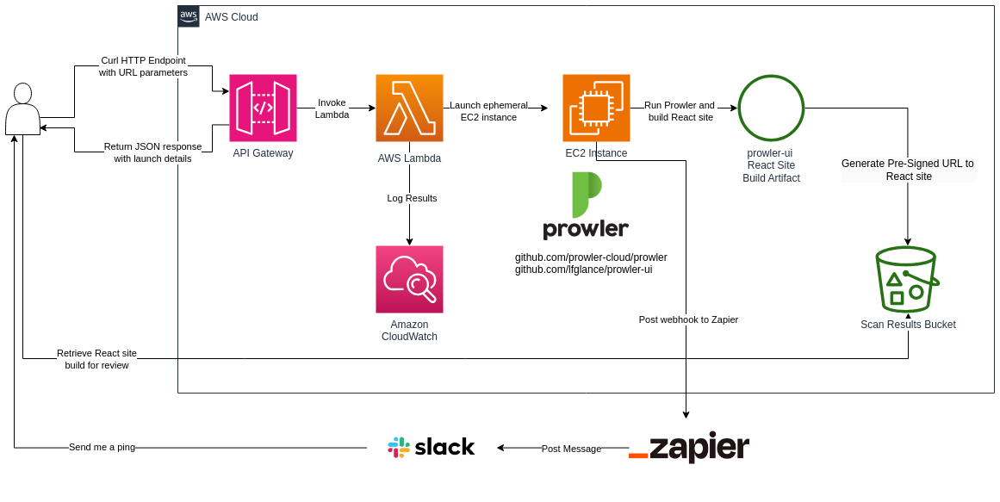

## AWS Prowler Scan Automation

This is a Python CDK stack to setup infrastructure for a Prowler scanner tool with custom UI output. Deploy the base infrastructure which launches ephemeral instances to run the scans and generate outputs and render a Cloudformation template to launch in remote accounts which need scans run against.

Useful for one-off scans with review used heavily in pre-sales motions at my AWS consulting company.

The end to end process is fully automated and uses Zapier webhooks to post a message into Slack with a link to a built React site. If you don't have that or want that you can omit the URL and simply poll the S3 bucket contents once it's synced from the instance. It is a tarball that you'll download and extract to view the data locally.



## Setup

Setup `config.py` with your details. You'll need to set the Zapier webhook url and your company or team name (identifier for the resource names).

Install `aws-cdk` and deploy the stack into the central AWS account. Note the outputs since you will need to know the API Gateway endpoint, S3 bucket, and Cross-Account IAM Roles. 

```bash
npm i -g aws-cdk
source .venv/bin/activate
pip install -r requirements.txt
cp config.sample.py config.py
vim config.py
cdk bootstrap
cdk deploy
```

Generate a JSON Cloudformation template to launch in the remote AWS accounts to scan against.

```bash
python render_cft.py
```

Launch the rendered file `ProwlerScannerRemote.json` as a Cloudformation stack in your remote account and capture the exports/outputs.

## Usage

The invocation point is an API Gateway with a single HTTP endpoint. Issue a GET request to the deployed API Gateway endpoint with the following URL parameters:

* `role_arn`: The IAM Role ARN in the remote account setup by the rendered `ProwlerScannerRemote.json` Cloudformation stack.
* `external_id`: The randomly created parameter to the Cloudformation stack.
* `scan_name`: The name to apply to generated artifacts.

Here is an example `curl` command you can use:

```bash
curl -s "https://xxxxxxx.execute-api.us-west-2.amazonaws.com/prod/?external_id=hello_@&role_arn=arn:aws:iam::1111111111:role/CrossAccountRole&scan_name=AcmeCorp"
# I like to pipe it to `jq` to get a pretty output
```

**The first time you run this unfortunately you will need to log into the AWS account and approve the Ubuntu AMI usage in the AWS Marketplace. This limitation is because Amazon Linux 2 comes with outdated Python and instead of compiling and installing it (which is time consuming) I opted for an LTS Ubuntu.**

Sample response:
```json
{
  "message": "Launched EC2 instance to run Prowler scan (LanceProwlerTesting)",
  "instance_profile": "arn:aws:iam::11111111:instance-profile/ProwlerScannerStack-InstanceProfile-zzzzzzzz",
  "prowler_version": "4.2.4",
  "sg_id": "sg-00000000",
  "instance_id": "i-00000000",
  "instance_type": "t2.medium",
  "subnet_id": "subnet-0000000000",
  "vpc_id": "vpc-0000000000",
  "ip_address": "10.0.151.20",
  "connection": "aws ssm start-session --target i-0000000",
  "output_bucket": "prowlerscannerstack-prowlerresultsbucket017fd61c-qqqqqqqq",
  "output_object": "LanceProwlerTesting-1721159874.tar.gz"
}
```

The response includes all of the information relevant to the outputs. After the instance is finished running the scan it will put the React site into the S3 website and terminate itself. You can wait to get the Slack message from the Zapier webhook sent from the instance or just periodically check the `website_url` from the payload received from API Gateway.

You can reference the `connection` from the payload to invoke an SSM session to shell into the server. You can tail the log file at `/var/log/cloud-init-output.log`:

```bash
aws ssm start-session --target i-00000
sudo -s
bash
tail -f /var/log/cloud-init-output.log
```